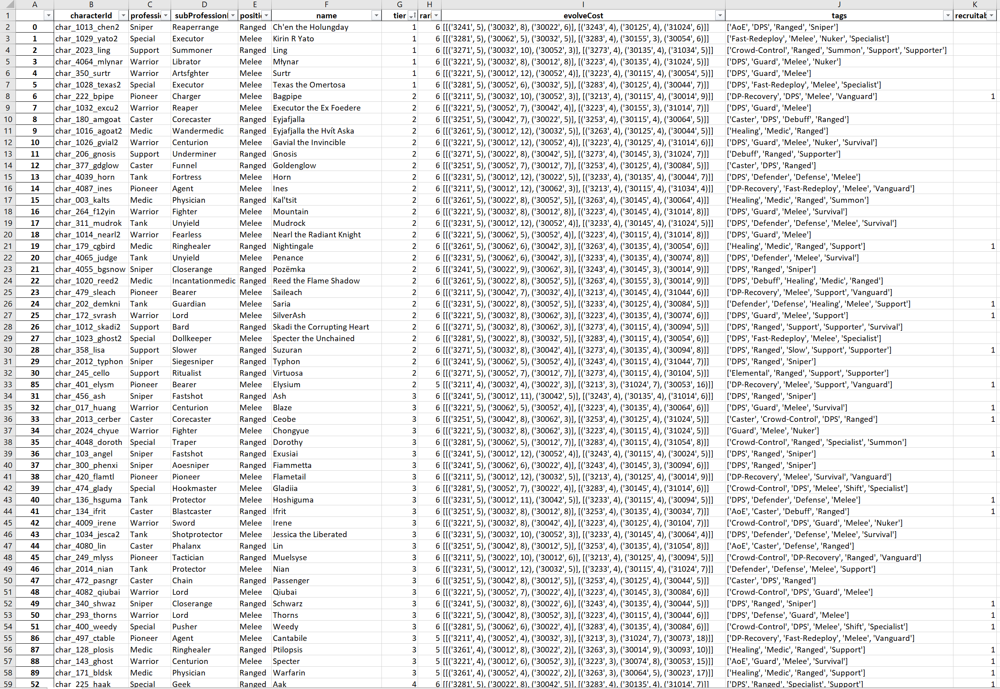
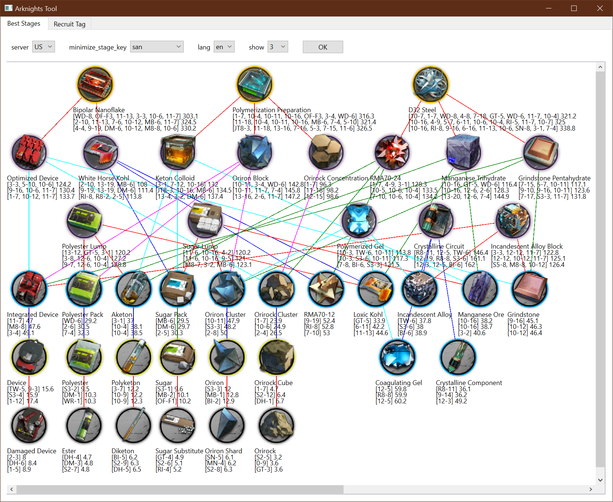
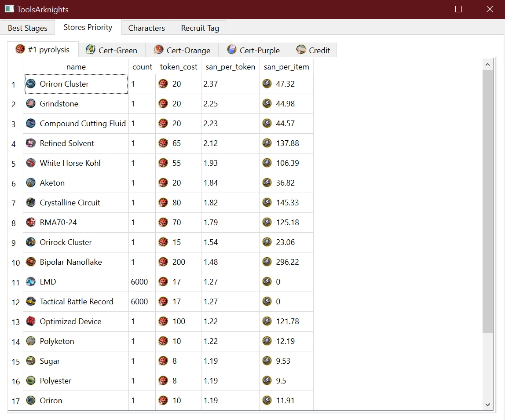
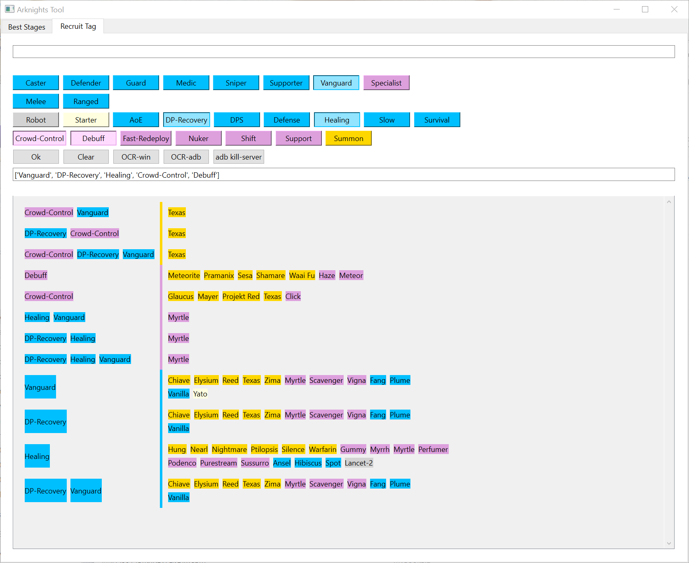
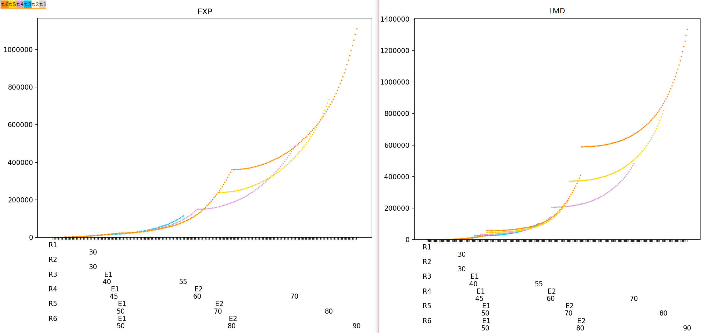
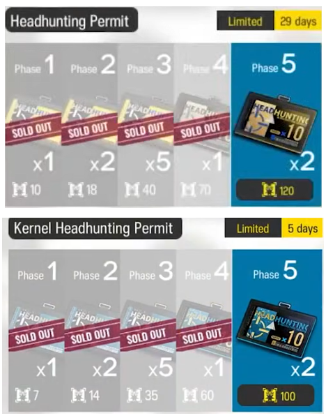

```python char.py``` generate char.xlsx 


```python ui_qt.py```


store priority


recruit tag


```python levelplot.py```


arknights side story to unlock:

```python stages.py``` by drop 
|                                   |                                                                ||
|-----------------------------------|----------------------------------------------------------------|-|
| Grani and the Knights' Treasure | GT-4[Sugar Substitute]rarity=0            | GT-5[Loxic Kohl->D32 Steel]4 |
| Heart of Surging Flame          | OF-F3[Sugar Pack->Bipolar Nanoflake]4                        ||
| Twilight of Wolumonde           | TW-5[Device]1      |TW-6[Incandescent Alloy->Crystalline Circuit]3|
| Mansfield Break                 | MB-6[Sugar Pack->Transmuted Salt Agglomerate]3               ||
| A Walk in the Dust              | WD-6[Polyester Pack->D32 Steel]4       |WD-8[RMA70-12->D32 Steel]4|
| Dossoles Holiday                | DH-4[Ester]0                                                 ||
| Break the Ice                   | BI-5[Diketon]0                                               ||
| Stultifera Navis                | SN-5[Oriron Shard]0                                          ||

```python furniture.py``` by furniture
| side story                                       | furniture store                             | in store   | full   | amb   | cost   | amb/cost   |
|--------------------------------------------------|---------------------------------------------|------------|--------|-------|--------|------------|
| Mansfield Break[Robin.R5.T6][36]                 | Mansfield Prison Cell                       | 1          | 0      | 5000  | 1225   | 4.082      |
| # Break the Ice                                  | Kjerag-Style Inn                            |            |        | 5000  | 1380   | 3.623      |
| # Lingering Echoes                               | Afterglow-Styled Music Room                 |            |        | 5000  | 1515   | 3.3        |
|                                                  | Stultifera Navis Reception Room             |            |        | 5000  | 1520   | 3.289      |
| # Invitation to Wine                             | Shan-Ch'eng Teahouse                        |            |        | 5000  | 1620   | 3.086      |
| # Dorothy's Vision                               | Rhine Experimental Culture Pod              |            |        | 5000  | 1650   | 3.03       |
| Near Light[Wild Mane.R5.T7][46]                  | Kazimierz Broadcast Center                  | 1          | 0      | 5000  | 1700   | 2.941      |
| Who is Real[Lava the Purgatory.R5.T9][36]        | Tan-Ch'ing Court                            | 1          | 0      | 5000  | 1795   | 2.786      |
| Under Tides[Gladiia.R6.T3][35]                   | Iberian Resort Town                         | 1          | 0      | 5000  | 1810   | 2.762      |
| Darknights Memoir[Sideroca.R5.T9][31]            | Seven Cities-style Restaurant               | 1          | 0      | 5000  | 1875   | 2.667      |
| Maria Nearl[Whislash.R5.T10][40]                 | Nearls' Living Room Replica                 | 1          | 0      | 5000  | 1885   | 2.653      |
| A Walk in the Dust[Heavyrain.R5.T7][32]          | Critical Response Team Office               | 1          | 0      | 5000  | 2015   | 2.481      |
| # Guide Ahead                                    | Laterano Notarial Hall Lounge               |            |        | 5000  | 2045   | 2.445      |
| # Operation Originium Dust                       | Special Equipment Exhibition Room           |            |        | 5000  | 2045   | 2.445      |
| Grani and the Knights' Treasure[Grani.R5.T9][24] | Express Chain Pizzeria                      |            |        | 5000  | 2120   | 2.358      |
| Twilight of Wolumonde[Folinic.R5.T8][40]         | Leithanian Nights                           | 1          | 0      | 5000  | 2190   | 2.283      |
| Dossoles Holiday[Tequila.R5.T5][39]              | Dossoles Private Spa                        | 1          | 0      | 5000  | 2240   | 2.232      |
| # Ideal City: Endless Carnival                   | Great Aquapit Funtastic Experientorium      |            |        | 5000  | 2250   | 2.222      |
| Heart of Surging Flame[Ceylon.R5.T11][40]        | Modern Music Rehearsal Room                 | 1          | 0      | 5300  | 2520   | 2.103      |
| The Great Chief Returns[Tomimi.R5.T11][36]       | Tribal-Style Inn                            | 1          | 0      | 5000  | 2415   | 2.07       |
| Code of Brawl[Bison.R5.T8][45]                   | Penguin Logistics Safehouse                 | 1          | 0      | 5000  | 3500   | 1.429      |
|                                                  | No.12 Life Cycle Cabin                      |            |        | 3045  | 2825   | 1.078      |
|                                                  | Side Line/ Simple Orange Furniture          |            |        | 2035  | 1945   | 1.046      |
|                                                  | Side Line/ Simple Black-and-white Furniture |            |        | 2035  | 1945   | 1.046      |
|                                                  | Ch'en's Office                              |            |        | 4915  | 5095   | 0.965      |
|                                                  | Fantastic Bio-documentary                   |            |        | 3195  | 3320   | 0.962      |
|                                                  | Columbian Café                              | 1          | 1      | 4420  | 4775   | 0.926      |
|                                                  | Secret Occult Society                       |            |        | 4800  | 5380   | 0.892      |
|                                                  | Caladon Light Store                         | 1          | 1      | 5000  | 5700   | 0.877      |
|                                                  | Victorian Royal Guard Academy Dormitory     |            |        | 5000  | 5705   | 0.876      |
|                                                  | Instrument Repair Workshop                  | 1          | 1      | 5000  | 5730   | 0.873      |
|                                                  | The Photography Hobbyist's Studio           | 1          | 1      | 5000  | 5735   | 0.872      |
|                                                  | The Zen Garden                              |            |        | 4800  | 5605   | 0.856      |
|                                                  | Modern Columbian Hotel                      | 1          | 1      | 4555  | 5330   | 0.855      |
|                                                  | Siesta Beach Hut                            | 1          | 1      | 4800  | 5650   | 0.85       |
|                                                  | Walter Interior Sensations                  | 1          | 1      | 4500  | 5300   | 0.849      |
| # Come Catastrophes or Wakes of Vultures         | BSW Safehouse                               |            |        |       |        |            |
| # IL Siracusano                                  | Siracusan Court of Justice                  |            |        |       |        |            |
| # What the Firelight Casts                       | Reed's Cabin                                |            |        |       |        |            |
| # Where Vernal Winds Will Never Blow             | Yumen Clinic                                |            |        |       |        |            |
| # Lone Trail                                     | Rhine Tech Eco-Garden                       |            |        |       |        |            |
| # Hortus de Escapismo                            | Ambulacrum Ambrosii                         |            |        |       |        |            |
| # So Long, Adele: Home Away From Home            | Trip to the 'White Volcano'                 |            |        |       |        |            |
| # Zwillingstürme im Herbst                       | Ludwigs-Universität Lecture Hall            |            |        | 5000  |        |            |

#### headhunt total cost
##### 10+18+40+70+120=258
##### 7+14+35+60+100=216
##### 100+180+400+700+1200=2580 ?


### Install
Install Python 3.12.2

Install tesseract https://github.com/UB-Mannheim/tesseract/wiki

```pip install -r pip_install_r_thisfile```

edit code:   ```ocrtag.py```:```pytesseract.pytesseract.tesseract_cmd = r'your path/tesseract.exe'```

add adb.exe to PATH https://developer.android.com/tools/releases/platform-tools


