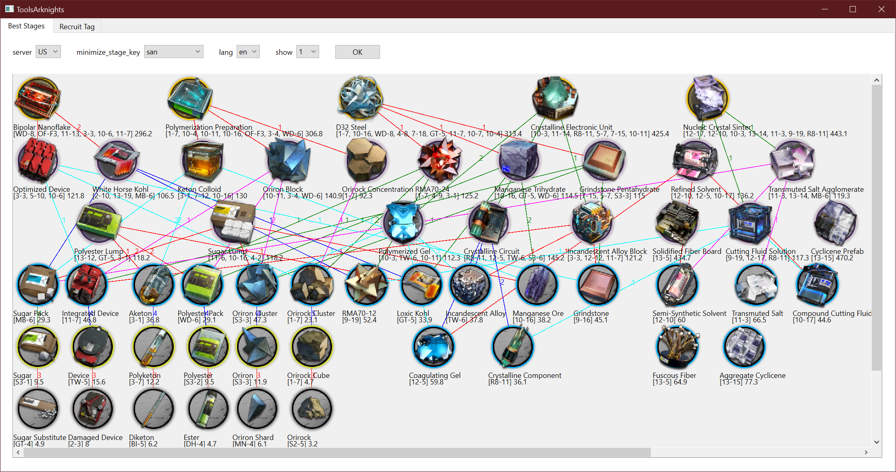
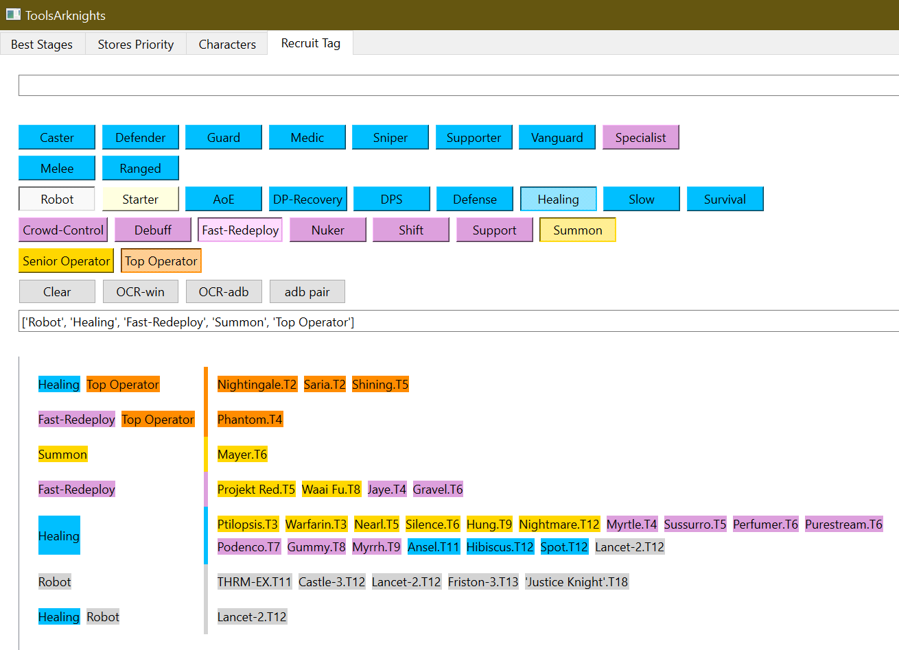

## ```python ui_qt.pyw```




## arknights side story to unlock (2024-4-23)
### by drop 
```python stages.py```
|                                   |                                                                ||
|-----------------------------------|----------------------------------------------------------------|-|
| Grani and the Knights' Treasure | GT-4[Sugar Substitute]rarity=0            | GT-5[Loxic Kohl->D32 Steel]4 |
| Heart of Surging Flame          | OF-F3[Sugar Pack->Bipolar Nanoflake]4                        ||
| Twilight of Wolumonde           | TW-5[Device]1      |TW-6[Incandescent Alloy->Crystalline Circuit]3|
| Mansfield Break                 | MB-6[Sugar Pack->Transmuted Salt Agglomerate]3               ||
| A Walk in the Dust              | WD-6[Polyester Pack->D32 Steel]4       |WD-8[RMA70-12->D32 Steel]4|
| Dossoles Holiday                | DH-4[Ester]0                                                 ||
| Break the Ice                   | BI-5[Diketon]0                                               ||
| Stultifera Navis                | SN-5[Oriron Shard]0                                          ||

### by furniture
| side story                     | fur store                                   | in store1 | full | amb  | cost | amb/cost    |
|--------------------------------|---------------------------------------------|-----------|------|------|------|-------------|
| Mansfield Break                | Mansfield Prison Cell                       | 1         | 0    | 5000 | 1225 | 4.081632653 |
| Break the Ice                  | Kjerag-Style Inn                            |           |      | 5000 | 1380 | 3.623188406 |
| Lingering Echoes               | Afterglow-Styled Music Room                 |           |      | 5000 | 1515 | 3.300330033 |
|                                | Stultifera Navis Reception Room             |           |      | 5000 | 1520 | 3.289473684 |
| Invitation To Wine             | Shan-Ch'eng Teahouse                        |           |      | 5000 | 1620 | 3.086419753 |
| Dorothy’s Vision               | Rhine Experimental Culture Pod              |           |      | 5000 | 1650 | 3.03030303  |
|                                | Kazimierz Broadcast Center                  | 1         | 0    | 5000 | 1700 | 2.941176471 |
| Who Is Real                    | Tan-Ch'ing Court                            | 1         | 0    | 5000 | 1795 | 2.78551532  |
|                                | Iberian Resort Town                         | 1         | 0    | 5000 | 1810 | 2.762430939 |
|                                | Seven Cities-style Restaurant               | 1         | 0    | 5000 | 1875 | 2.666666667 |
| Maria Nearl                    | Nearls' Living Room Replica                 | 1         | 0    | 5000 | 1885 | 2.652519894 |
|                                | Express Chain Pizzeria                      | 1         | 0    | 5585 | 2120 | 2.634433962 |
|                                | Critical Response Team Office               | 1         | 0    | 5000 | 2015 | 2.481389578 |
| Guide Ahead                    | Laterano Notarial Hall Lounge               |           |      | 5000 | 2045 | 2.444987775 |
|                                | Special Equipment Exhibition Room           |           |      | 5000 | 2045 | 2.444987775 |
| Twilight of Wolumonde          | Leithanian Nights                           | 1         | 0    | 5000 | 2190 | 2.283105023 |
| Dossoles Holiday               | Dossoles Private Spa                        | 1         | 0    | 5000 | 2240 | 2.232142857 |
| Ideal City: Endless Carnival   | Great Aquapit Funtastic Experientorium      |           |      | 5000 | 2250 | 2.222222222 |
| Heart of Surging Flame         | Modern Music Rehearsal Room                 | 1         | 0    | 5300 | 2520 | 2.103174603 |
| Gavial The Great Chief Returns | Tribal-Style Inn                            | 1         | 0    | 5000 | 2415 | 2.070393375 |
| Code of Brawl                  | Penguin Logistics Safehouse                 | 1         | 0    | 5000 | 3500 | 1.428571429 |
|                                | No.12 Life Cycle Cabin                      |           |      | 3045 | 2825 | 1.077876106 |
|                                | Side Line/ Simple Black-and-white Furniture |           |      | 2035 | 1945 | 1.046272494 |
|                                | Side Line/ Simple Orange Furniture          |           |      | 2035 | 1945 | 1.046272494 |
|                                | Ch'en's Office                              |           |      | 4915 | 5095 | 0.964671246 |
|                                | Fantastic Bio-documentary                   |           |      | 3195 | 3320 | 0.962349398 |
|                                | Columbian Café                              | 1         | 1    | 4420 | 4775 | 0.92565445  |
|                                | Secret Occult Society                       |           |      | 4800 | 5380 | 0.892193309 |
|                                | Caladon Light Store                         | 1         | 1    | 5000 | 5700 | 0.877192982 |
|                                | Victorian Royal Guard Academy Dormitory     |           |      | 5000 | 5705 | 0.876424189 |
|                                | Instrument Repair Workshop                  | 1         | 1    | 5000 | 5730 | 0.872600349 |
|                                | The Photography Hobbyist's Studio           | 1         | 1    | 5000 | 5735 | 0.871839582 |
|                                | The Zen Garden                              |           |      | 4800 | 5605 | 0.856378234 |
|                                | Modern Columbian Hotel                      | 1         | 1    | 4555 | 5330 | 0.854596623 |
|                                | Siesta Beach Hut                            | 1         | 1    | 4800 | 5650 | 0.849557522 |
| Near Light                     | Walter Interior Sensations                  | 1         | 1    | 4500 | 5300 | 0.849056604 |

## Install
Install Python 3.12.2

Install tesseract https://github.com/UB-Mannheim/tesseract/wiki

```pip install -r pip_install_r_thisfile```

edit code:   ```anhrtags.pyw```:```pytesseract.pytesseract.tesseract_cmd = r'your path/tesseract.exe'```


### ADB
  add adb.exe to PATH https://developer.android.com/tools/releases/platform-tools
#### to use wireless adb:
  ```adb pair 192.168.0.39:15468 314692```
  

